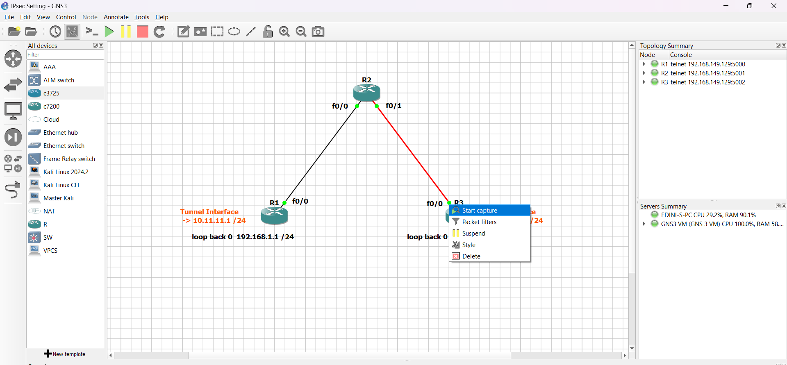
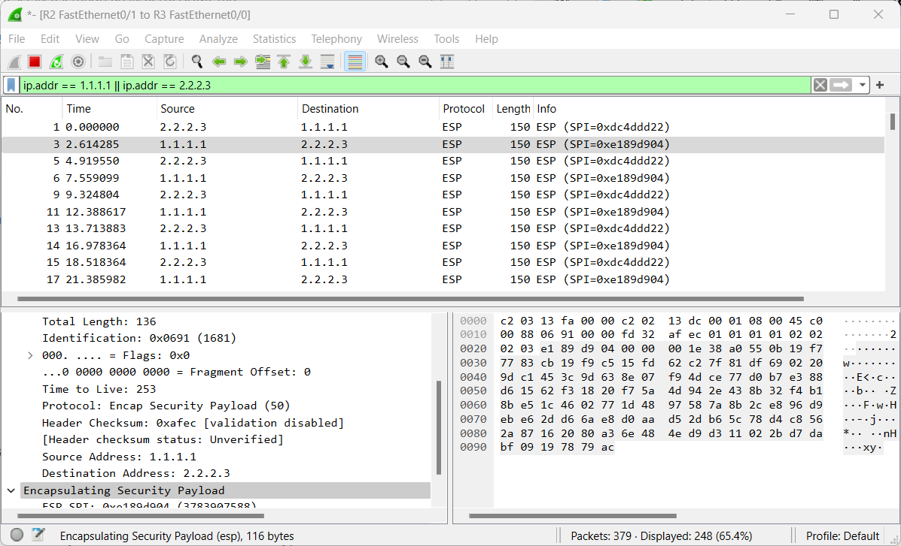
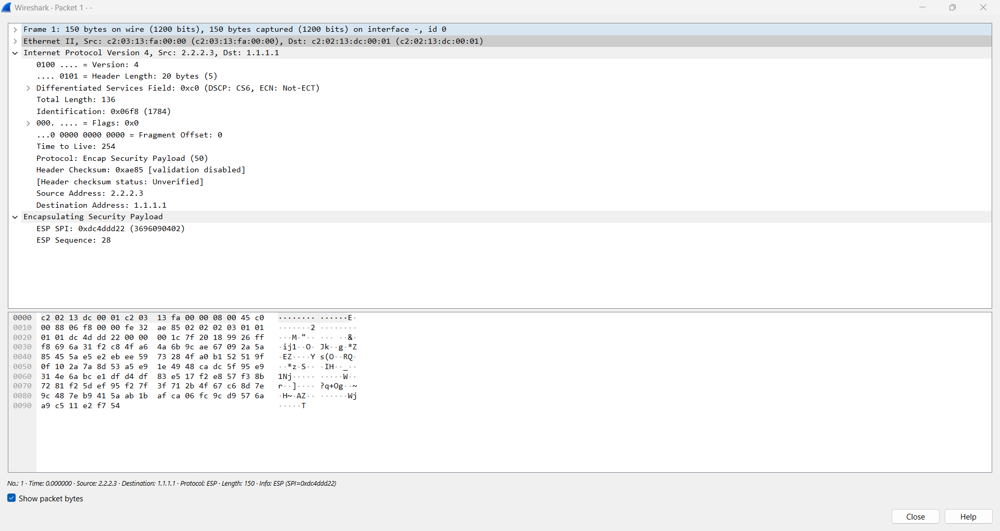

# IPsec Setting Part 2: ISAKMP & IPsec Configuration

In this section, we'll configure ISAKMP and IPsec settings on routers R1 and R3 to secure the communication between them. Follow the steps below to complete the setup.

## 1. Define ISAKMP Policy on Router R1 & R3

On **Router R1**:

```bash
crypto isakmp policy 10
hash md5
authentication pre-share
group 2
encryption 3des
exit
```

On **Router R3**:

```bash
crypto isakmp policy 10
hash md5
authentication pre-share
group 2
encryption 3des
exit
```

## 2. Define Pre-shared Key on a Per Peer Basis on Router R1 & R3

On **Router R1**:

```bash
crypto isakmp key 0 cisco123 address 2.2.2.3
```

On **Router R3**:

```bash
crypto isakmp key 0 cisco123 address 1.1.1.1
```

## 3. Configure Transform Sets on Router R1 & R3

On **Router R1**:

```bash
crypto ipsec transform-set TSET esp-3des esp-md5-hmac
exit
```

On **Router R3**:

```bash
crypto ipsec transform-set TSET esp-3des esp-md5-hmac
exit
```

## 4. Create IPsec Profile on Router R1 & R3

On **Router R1**:

```bash
crypto ipsec profile GRE-PROFILE
set transform-set TSET
exit
```

On **Router R3**:

```bash
crypto ipsec profile GRE-PROFILE
set transform-set TSET
exit
```

## 5. Assign IPsec Profile on Tunnel Interfaces

On **Router R1**:

```bash
interface tunnel 1
tunnel protection ipsec profile GRE-PROFILE
exit
```

On **Router R3**:

```bash
interface tunnel 1
tunnel protection ipsec profile GRE-PROFILE
exit
```

## Verification

1. **Start Packet Capture**:

   - On **Router R3**, right-click on the `fa0/0` interface and select "Start Capture". This will open Wireshark or a similar tool to monitor the traffic on this interface.

     

2. **Initiate Traffic**:

   - On **Router R1**, run the following command to send a ping from R1's loopback interface to R3:
     ```bash
     ping 172.16.3.3 source loopback 0
     ```

3. **Analyze the Packet Capture**:

   - In Wireshark, filter the captured traffic using the IP address of either Router R1 or Router R3. You can apply the filter like this:
     ```
     ip.addr == 1.1.1.1 || ip.addr == 2.2.2.3
     ```
   - Look at the **Protocol** column in Wireshark:
     - You should see packets labeled as **ESP (Encapsulating Security Payload)**, which indicates that the traffic is encrypted.
     - The **Info** column should show "ESP" instead of the higher-level protocols like ICMP, indicating that the ping request and response are being encrypted.

   

4. **Detailed View**:

   - Click on any of the ESP packets and expand the **Internet Protocol Security** section in Wireshark.
   - You won't be able to see the inner contents of the packet (like the ICMP echo request and reply) because they are encrypted. This lack of visibility confirms that the traffic is encrypted.

   

## What to Observe

- **Encrypted Packets**: If IPsec is correctly configured, all packets between the routers that should be secured will appear as ESP packets in the capture, indicating that the data is encrypted.
- **No Cleartext Data**: The ping responses and requests will not be visible as regular ICMP packets, confirming that the communication is being encrypted by IPsec.
