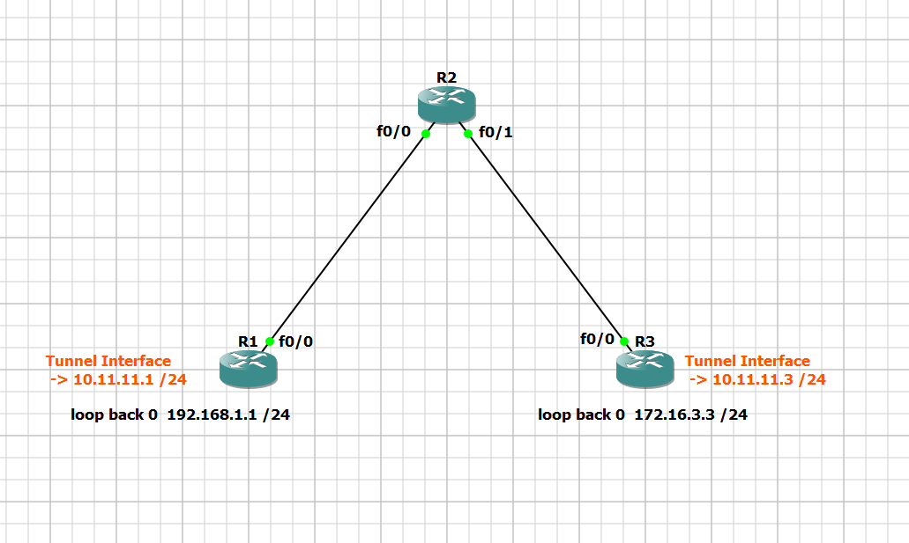

# GNS3 Topology Setup for IPsec Configuration

This guide will walk you through setting up a network topology in GNS3 to configure IPsec between routers. The topology consists of three routers (R1, R2, and R3) connected as shown below.

## Topology Diagram

## Step-by-Step Instructions

1. **Launch GNS3**:

   - Open GNS3 and create a new project for the IPsec setup.

2. **Add Routers to the Workspace**:

   - Drag and drop three routers onto the workspace from the device list.
   - Rename the routers to `R1`, `R2`, and `R3` respectively.

3. **Connect the Routers**:

   - Use the "Add a Link" tool to connect the routers as follows:
     - **R1**: Connect the `f0/0` interface to `f0/0` on **R2**.
     - **R3**: Connect the `f0/0` interface to `f0/1` on **R2**.

4. **Navigate to Configuration Directories**:

   - After setting up the topology, navigate to the `part 1` and `part 2` directories in the main folder of your project.
   - In these directories, you will find detailed instructions and configuration files required to complete the IPsec setup.
     - **Part 1**: Contains the initial configurations for the routers.
     - **Part 2**: Includes the IPsec configuration steps and final adjustments.

5. **Save Your Project**:
   - Save your project once the topology and configurations are complete.

## Additional Notes

- This topology is designed to facilitate IPsec configuration between the routers. The diagram provided should be used as a visual reference.
- Make sure to follow the instructions in `part 1` and `part 2` directories closely to ensure proper IPsec setup.
